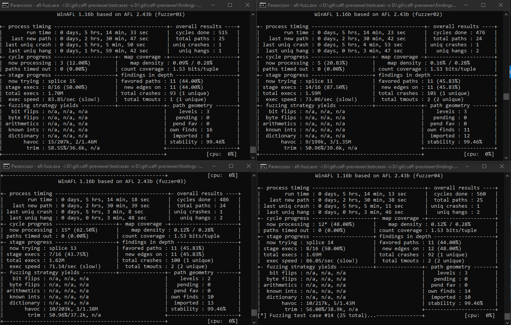

# Testing of CAFF Previewer

# AFL
Fuzz testing was conducted using WinAFL, the Windows adaptation of AFL. This test during the several hours it ran in four threads paralelly only found one test case which caused the program to crash. 

The [file](id_000000_00_EXCEPTION_ACCESS_VIOLATION.caff) which caused the program to crash can be found next to this in the doc directory.

# Valgrind
We used the file generated by AFL during testing with valgrind.

The error reported by valgrind was the following: Invalid read of size 1

This means that the memory location the process was trying to read from is outside of the memory addresses available to the process.